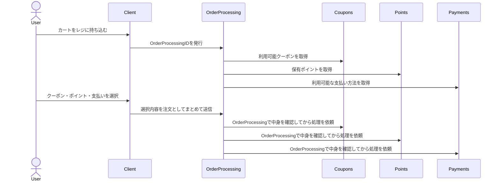
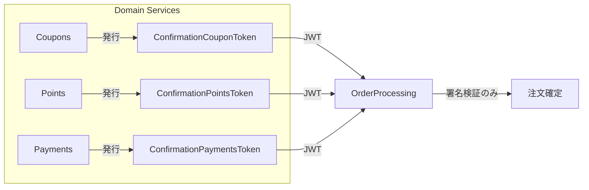

# 確認済みトークンによる疎結合オーケストレーション ― Capability Token Relay Pattern

## はじめに

マイクロサービス化が進むと、複数のドメインが連携して1つのユースケースを完結させる構造が増えてきます。
たとえば、ECサイトでの「購入処理」では、クーポン、ポイント、支払いといった異なるサービスが協調して動作します。

しかし、これらをオーケストレーションする「注文処理サービス（OrderProcessing）」が、それぞれのドメインの詳細な知識を持ち始めると、システムは急速に密結合化していきます。
この問題に対して、本記事では「確認済みトークン（Confirmed Token）による疎結合設計」というアプローチを紹介します。

## 背景 ― オーケストレータが持ちすぎる知識の問題

次のような構成を考えます。



ここで課題になるのは、OrderProcessing が各サービスのロジックを知りすぎることです。

- クーポンの有効性
- ポイント残高の減算可能性
- 支払いステータスの確定条件

など、すべての知識を集約すると、「中央集権的な取引マネージャ」になってしまいます。

## 発想の転換 ― 「確認済みトークン」を渡す

ここで導入するのが Confirmed Token（確認済みトークン） の考え方です。

各ドメインが、ユーザーの入力や事前検証の結果をもとに「自ドメインの確認済み証明書」を発行します。
これを中継サービス（OrderProcessing）が受け取り、署名検証だけを行って統合します。

構造イメージ



これにより、OrderProcessing は各ドメインのルールを知らなくても安全に統合処理を行えます。

## JWTによる実装 ― 「中身を理解しない安全な封筒」

Confirmed Token は JWT（JSON Web Token）として表現します。
OrderProcessing は署名検証を行うだけで、中身を理解しません。

JWTクレーム例

```json
{
  "iss": "coupons.svc",
  "aud": "order-processing",
  "sub": "user_123",
  "iat": 1730123456,
  "exp": 1730123516,
  "jti": "cpt_89f1b8",
  "order_processing_id": "op_99123",
  "capabilities": ["coupons:redeem"],
  "constraints": {
    "coupon_ref": "abc123",
    "amount_sha256": "2fa8d1..."
  }
}
```

OrderProcessing が行うことは、次の4点だけです。

1. 署名を検証する（発行者issの公開鍵で）
2. aud, exp, jti, order_processing_idを確認
3. jtiの再利用を防ぐ（ワンタイム使用）
4. capabilitiesを見て、どのサービスへ送るか判断する

中身の意味（たとえばamount_sha256が何を指すか）は知らない、という点が重要です。


## この設計の狙い

| 観点          | 目的                                          |
|---------------|-----------------------------------------------|
| 疎結合        | OrderProcessingが各ドメインの知識を持たない   |
| 安全性        | 署名＋短寿命JWTで改ざん防止／リプレイ防止     |
| 監査性        | jti（トークンID）単位で追跡可能               |
| 明確な責務分離| ドメインが自らのルールを守り、自分で署名する  |

この構造は、まさに「封筒モデル（Envelope Model）」とも言えます。
OrderProcessingは封筒が正しい形式で届いているか確認するだけで、中の手紙の内容は読みません。

## 実装上の注意点

- jtiによるワンタイム制御（再利用防止）
- 公開鍵のローテーション（kid対応）
- 機微情報はトークンに含めず、必要ならJWEで暗号化
- 各ドメインで発行と失効を管理（OrderProcessingは管理しない）
- 有効期限（exp）は数分以内に設定


## まとめ

この設計は、JWTを「権限」ではなく「確認済み証明（confirmation）」として扱う発想です。
OrderProcessingはトークンの正当性のみを保証し、各ドメインが自らのルールを守って実行します。

結果として、疎結合で安全なオーケストレーションを実現でき、
ドメインの境界を保ちながら「1つの購入体験」を組み立てることができそうです。

